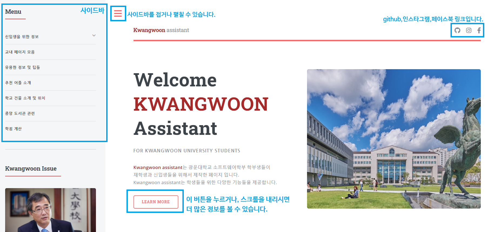
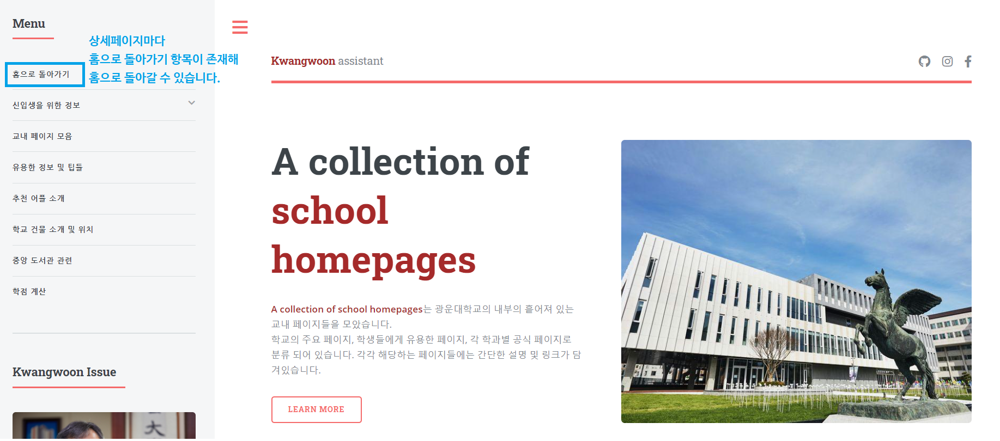

# 오픈소스소프트웨어개발 팀 프로젝트
--------------------
### 1. 프로젝트 내용
    광운대학교 재학생 및 신입생이라면, 광운대학교 웹 사이트에 들어가 정보를 확인한 경험이 있을 것입니다. 
    그리고 학생들은 광운대학교 KLAS, 에브리타임 등을 통하여 정보를 얻습니다. 
    하지만, 정보가 이곳저곳에 흩어져 있어서 학생들에게 도움이 될 만한 정보를 한번에 접하기는 쉽지 않습니다. 
    그래서 이러한 문제점을 해결하고 학생들이 더욱더 편리하고 쉽게 정보를 접할 수 있도록 하기 위해 
    우리 팀은 '광운대학교 학생들을 위한 정보제공 웹 사이트'를 제작하였습니다.

### 2. 설치 방법
    해당 사이트는 특별한 설치 방법이 없어서 접속하기에 매우 간편합니다.
    데스크탑이나 노트북으로 접속하는 것을 권장해 드리며, 
    밑의 링크로 접속하여 사이트를 이용하시면 됩니다.
> #### *<u>사이트 접속하기</u>* : <https://liyusang1.github.io/opensourcedevelop/project/index.html>

### 3. 사용 방법
    사이트에 접속하면 메인 페이지로 접속하게 됩니다.
    사이드바에서 원하는 메뉴를 선택하면 해당 페이지로 이동합니다.
    밑의 사진을 참고하면 더 쉽게 사이트를 이용할 수 있습니다.

    예를 들어, '교내페이지 모음' 관련 정보를 얻기 위해 해당 페이지로 이동해보겠습니다.

    이동하면 다음과 같은 페이지가 뜨고, 정보를 확인할 수 있습니다.
    상세페이지들 모두 메인페이지와 디자인을 동일하게 웹 사이트를 제작하였습니다.
    
 

> #### 사이트를 이용하면서 문의 사항이 있으신 경우나, 
> #### 추가개발에 기여하고 싶으신 경우에는 *liyusang1@naver.com*으로 연락 부탁드립니다 :)
